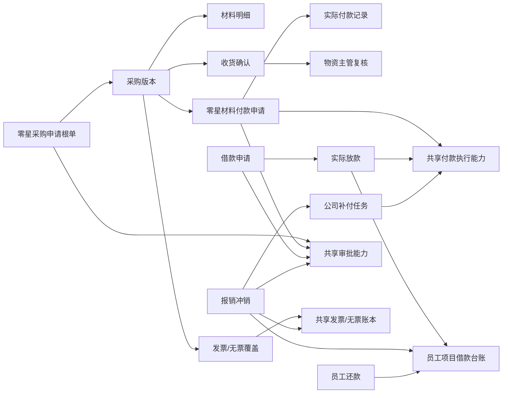

# 建工智管零星采购与费用报销升级设计

日期：2026-07-16

状态：五阶段设计已确认，已纳入增值税发票类型、税率和含税单价规则，待用户复核后制定实施计划

范围：项目零星材料采购、零星材料付款、收货确认、借款申请、报销冲销、员工还款、员工项目往来台账，以及共用的付款事实、发票/无票、附件、PDF 和审计能力

决策：零星采购与费用报销拆成两个独立一级业务模块；不继续把新能力堆入单一 `ProjectExpenseRequest`，但复用现有审批、付款执行、私有文件、PDF、审计和金额基础设施

## 1. 结论

本次升级采用“独立业务单据 + 共用基础能力”的方案：

- `零星采购` 与合同、结算、付款一样成为独立一级模块。
- `费用与报销` 成为另一个独立一级模块。
- 零星采购申请、零星采购付款、收货确认分别保存各自业务事实。
- 借款、报销冲销、员工还款分别保存各自业务事实，并共同形成员工项目往来台账。
- 审批、实际付款、付款凭证、发票/无票、私有附件、最新版 PDF 和审计由共享能力承载。
- 当前 `ProjectExpenseRequest` 继续作为既有轻量报销/零星采购历史事实，不强制改写历史数据。

本设计不是完整采购 ERP，也不是完整发票平台。它先建立可审计、可扩展的真实业务闭环，为以后增加供应商管理、采购订单、入库、库存、询比价和统一发票系统保留稳定接口。

## 2. 当前事实与复用边界

仓库当前已经具备以下能力：

- `ProjectExpenseRequest` 同时承载轻量报销与零星采购。
- 已有项目支出审批、已批待付、实际付款、付款凭证、财务入账、PDF 和审计链路。
- 已有私有文件上传、后端授权下载、短时效地址和下载审计。
- 已有审批实例冻结、董事长/总经理 OR 签、普通申请人自审限制和领导自审确认。
- 金额已经使用整数分和 `BIGINT` 安全口径，API 以十进制字符串传递金额。
- Web Admin 已统一使用 Vue 3、TypeScript、TDesign Vue Next 和项目设计令牌。

现有能力应继续复用，但复用的是通用能力，不是继续扩大单一表的职责：

| 能力 | 处理方式 |
| --- | --- |
| 审批引擎 | 复用；为新业务单据冻结独立审批实例 |
| 实际付款与付款凭证 | 复用规则和执行能力；业务来源必须可追溯 |
| 私有文件 | 复用上传、授权下载、替换链和审计 |
| PDF | 复用生成、私有存储、下载授权和失败重试 |
| 审计 | 复用统一审计基础设施，补充新业务动作 |
| 金额 | 继续使用整数分、`BIGINT` 和字符串 API 契约 |
| `ProjectExpenseRequest` | 保留历史查询；不作为新模块的总表继续膨胀 |
| 发票/无票 | 新增轻量共享账本，为未来发票系统提供来源 |
| 收货照片水印 | 新增服务端派生能力，原图与水印图均保留 |

## 3. 目标与非目标

### 3.1 本次目标

- 将零星材料采购从“一个费用付款单”升级为采购申请、付款、收货、发票/无票相互关联的业务闭环。
- 让采购申请以材料明细表形式编制，并自动计算金额合计。
- 支持同一采购分次付款、财务直接付供应商和经办人垫付后报回。
- 支持付款与收货顺序灵活，在全部条件满足后自动办结。
- 建立员工在每个项目下的借款余额、冲销、补付和还款台账。
- 让同一项目、同一报销人可以合并多类费用办理报销冲销。
- 为每类审批单据建立最新版 PDF 派生接口，并与另一个审批单改造任务保留清晰边界。
- 保留完整审批、金额、付款、文件和调整审计。

### 3.2 本次不做

- 不建设完整采购订单、询价比价、招标、库存、领料、退料和仓库系统。
- 不建设供应商准入、评级、黑名单和完整供应商主数据治理。
- 不建设 OCR 识票、税务验真、自动抵扣或完整电子发票平台。
- 不建设预算科目树、费用标准、差旅行程和多人分摊 OA。
- 不改变合同、结算和普通付款的既有业务状态机。
- 不在本任务中决定审批签名采用姓名文本、签名图片还是手写签名版本。
- 不在本任务中最终确定所有角色的查看和下载范围。
- 不自动迁移或删除既有 `ProjectExpenseRequest` 历史数据。

以上内容不是遗漏，而是明确留给后续独立设计，不能在实施中顺带扩张。

## 4. 总体架构与模块边界

### 4.1 一级模块

Web 左侧导航增加两个独立一级业务标题。

```text
零星采购
├─ 零星采购工作台
├─ 零星材料付款工作台
└─ 收货确认工作台

费用与报销
├─ 费用与报销工作台
└─ 员工项目往来台账
```

采购详情、付款详情、借款详情和报销冲销详情属于相应模块页面，由工作台单号或待办进入，不作为左侧菜单中的固定入口。

费用与报销工作台提供三个一等业务动作：

- 借款申请。
- 报销冲销。
- 员工还款。

用户看到的是统一工作台，后端保存的是三个职责不同、相互关联的业务单据。

### 4.2 领域关系



### 4.3 核心边界

- 采购申请只回答为什么买、向谁买、买什么、数量和价格是多少。
- 采购付款只回答本次申请支付多少、付给谁、采用何种支付路径。
- 实际付款只记录公司真实付出了多少钱、何时付、由谁付、使用何种凭证。
- 收货确认只记录材料是否真实到场、由谁确认、照片证据和物资主管复核。
- 发票/无票只记录金额证据覆盖，不替代付款或收货事实。
- 借款余额只因真实放款增加，只因已批准冲销或财务确认还款减少。
- PDF 是业务事实的派生文件，不是唯一业务账本。

## 5. 核心业务对象

以下名称用于表达领域边界，最终数据库表名可在实施计划中按仓库命名规范确定。

### 5.1 零星采购域

| 业务对象 | 责任 |
| --- | --- |
| 零星采购根单 | 固定采购编号、项目、申请关系和当前有效版本 |
| 采购版本 | 冻结供应商、采购原因、经办人、材料明细、票据条件、合计和附件快照 |
| 材料明细 | 保存材料名称、规格型号、单位、数量、票据方式、发票类型、税率、含税/无票单价、金额和用途 |
| 零星材料付款申请 | 保存本次拟付款金额、支付路径、收款对象和独立审批 |
| 实际付款记录 | 保存实际付款金额、日期、方式、经办财务人员和付款凭证 |
| 收货确认 | 保存确认人、委托关系、照片、水印文件、时间和说明 |
| 收货复核 | 保存物资主管复核结论、意见和时间 |
| 发票分摊 | 将发票金额分配到采购及其付款申请 |
| 无票确认 | 保存无票金额、原因、替代凭证和财务主管确认 |

### 5.2 费用与报销域

| 业务对象 | 责任 |
| --- | --- |
| 借款申请 | 保存员工、项目、借款原因、金额和审批事实 |
| 借款放款 | 保存一笔或多笔真实放款及凭证 |
| 员工项目借款账户 | 汇总某员工在某项目下的借款、冲销、还款和余额 |
| 借款台账分录 | 保存每次增减余额的不可变账务事实 |
| 报销冲销单 | 保存费用明细、冲销金额、公司补付金额和审批事实 |
| 报销费用明细 | 保存日期、费用类别、事由、金额、票据覆盖和备注 |
| 冲销分配 | 保存本次冲销具体抵扣了哪些借款放款 |
| 冲销预留 | 审批期间冻结本单可使用的借款余额 |
| 员工还款登记 | 保存员工还款金额、方式、凭证和财务到账确认 |
| 公司补付任务 | 保存报销金额超过借款余额后公司的待付款事实 |

### 5.3 共享发票与无票账本

轻量发票记录至少保存：

- 发票类型：增值税普通发票或增值税专用发票。
- 发票代码/号码或可识别票据编号。
- 开票日期。
- 销售方名称。
- 购买方名称。
- 发票明细税率。
- 价税合计金额。
- 发票文件。
- 上传人、上传时间和来源业务。
- 可分摊金额、已分摊金额和状态。

发票通过金额分摊关系连接采购或报销费用明细。一个发票可以分摊到同一业务范围内的多个明细，一个明细也可以由多张发票覆盖，但累计分摊不得超过发票金额或业务金额。

零星采购以“采购根单 + 当前有效版本”作为发票覆盖的唯一汇总口径，付款申请只保存这笔发票金额具体对应哪些付款的明细关系。付款层关系不能再次增加采购覆盖金额，避免同一发票在采购层和付款层被重复计算。报销以费用明细作为覆盖口径。

无票确认至少保存：

- 无票金额。
- 无票原因。
- 替代证明文件。
- 提交人和提交时间。
- 财务主管确认人、确认时间和意见。
- 当前有效或已冲销状态。

发票和无票金额不得重叠占用同一业务金额。所有分摊和确认都必须可冲销，不得直接改写已生效历史。

本期发票账本只覆盖零星采购和费用报销。合同、结算及其他付款以后接入统一发票系统时复用同一发票记录和分摊能力，但不在本次实施范围内。借款放款和员工还款不是费用支出，不要求上传发票。

## 6. 零星采购业务设计

### 6.1 采购申请与审批

采购申请人允许为物资员或物资主管。申请必须指定采购经办人，采购经办人负责后续付款草稿确认和收货责任。

审批流程固定为：

```text
物资员/物资主管发起
  -> 物资主管
  -> 项目经理
  -> 采购申请审批完成
```

如果物资主管本人发起，系统自动跳过物资主管节点，直接进入项目经理审批。跳过必须记录为流程事实，不能伪造一条“物资主管已审批”记录。

合同部、预算部、综合部和财务部不进入采购申请审批。

审批人不能直接修改申请内容，只能：

- 同意。
- 驳回。
- 退回申请人。
- 使用审批引擎已经支持且当前流程允许的其他动作。

申请被退回后，由申请人修改并重新提交。

### 6.2 采购申请工作台与表格

采购申请表头至少包含：

- 项目。
- 采购编号。
- 申请人。
- 采购经办人。
- 供应商名称。
- 采购原因。
- 申请日期。
- 备注。

一张采购根单只对应一家供应商；不同供应商必须分别创建采购申请，不能在同一张材料明细表中混用。

第一阶段供应商名称必填并在提交时冻结，同时允许保存一个可空的既有合作单位引用，但不能为了本模块先建设完整供应商主数据；付款时的收款方名称必须与冻结供应商一致。

材料明细至少包含：

- 材料名称。
- 规格型号。
- 单位。
- 数量。
- 预计票据方式：有票或无票。
- 发票类型：增值税普通发票或增值税专用发票，有票时必填。
- 税率：有票时必填。
- 含税单价：有票时必填。
- 无票单价：无票时必填。
- 自动计算金额。
- 使用部位或用途。
- 备注。

发票属性按材料明细行填写，同一行只能选择一种票据方式。相同材料如果部分有票、部分无票，或者发票类型、税率不同，必须拆成多行分别填写。

税率不能由经办人任意输入文本，应从财务维护的启用税率选项中选择，并在采购版本提交时保存显示值和数值快照。本设计不在代码中永久写死具体税率，以便财务在税务政策或公司口径变化时受控维护。

金额规则：

```text
有票明细金额 = 数量 × 含税单价
无票明细金额 = 数量 × 无票单价
采购金额合计 = 所有有效明细金额之和
```

采购审批、付款占用和办结统一使用实际应付价口径：有票材料按含税单价计算，无票材料按无票单价计算；有票材料不能用不含税单价参与审批合计。前端展示金额合计，后端以适合数量与单价精度的定点数重新计算，并将明细金额和采购金额合计按统一规则落为整数分。客户端传入的合计只能作为显示值，不能作为最终账本依据。

申请附件为零到多个，不是提交必填项。允许上传：

- 商家报价单。
- 商品或材料清单。
- 现场参考照片。
- Excel。
- Word。
- PDF。
- 其他受控文件类型。

申请阶段现场照片可传可不传，不得与收货阶段的必传照片混为一类。

### 6.3 版本冻结与变更

采购申请提交后冻结以下事实：

- 供应商。
- 采购原因。
- 采购经办人。
- 材料名称。
- 规格型号。
- 单位。
- 数量。
- 预计票据方式。
- 发票类型。
- 税率。
- 含税单价或无票单价。
- 金额合计。
- 申请附件快照。

实际采购必须与当前有效版本完全一致。供应商、规格型号、数量、预计票据方式、发票类型、税率或单价发生任何变化，都必须：

1. 在同一个采购根单下创建新版本。
2. 从上一版本复制数据。
3. 明确标记发生变化的字段和变更原因。
4. 重新走完整采购申请审批。
5. 保留旧版本及其审批记录。
6. 将旧版本标记为已失效，不能继续产生新的付款或收货事实。

版本切换规则：

- 只有草稿付款申请可以直接失效并按新版本重新生成。
- 已提交或已批准的付款申请必须先按其状态机退回或作废，才能创建新采购版本。
- 已存在真实付款记录时，普通变更入口硬阻断，不允许通过改版本掩盖已经发生的付款事实。
- 收货已经确认但尚未付款时，新版本会使原收货复核失效，必须针对新版本重新确认和复核；原照片与操作历史继续保留。

真实付款后的差错只能通过未来单独设计的异常更正、退货或反向流水处理，本设计不允许静默覆盖。

### 6.4 自动生成付款草稿

采购申请最终审批通过后，系统自动创建第一张关联的零星材料付款草稿，但不自动替经办人提交审批。

草稿默认带入：

- 项目。
- 采购根单和有效版本。
- 冻结供应商。
- 采购金额合计。
- 当前剩余可申请付款金额。
- 采购经办人。

经办人必须补齐并确认：

- 本次申请付款金额。
- 支付路径。
- 收款对象。
- 收款账户或现金方式说明。
- 预计付款日期。
- 付款说明。
- 支撑附件。

第一张草稿可以默认带入当前剩余可申请金额，但经办人可在提交前改为较小金额。后续仍有未申请金额时，经办人可以继续创建新的付款申请。

### 6.5 付款申请与审批

同一个采购根单允许存在多张付款申请，用于分期或分次付款。所有有效付款申请的申请金额合计不得超过当前有效采购版本的金额合计。

付款草稿不占用采购可申请金额；付款申请提交审批时才在事务中占用对应金额。付款申请被驳回、作废或因采购版本变化失效时释放占用。即使多个草稿同时存在，后提交者也必须按最新剩余金额重新校验。

付款路径有两种：

1. 财务直接支付给冻结供应商。
2. 采购经办人已经个人垫付，公司报回给采购经办人。

同一个采购可以混合使用两种路径，但每一张付款申请只能选择一种路径。

约束如下：

- 财务直付时，收款方名称必须等于冻结供应商名称。
- 经办人垫付报回时，公司收款人必须是采购经办人。
- 经办人垫付必须提供向商家付款的交易证明。
- 公司向经办人报回后，还必须保存公司付款凭证。
- 采购经办人的垫付报回属于零星采购付款，不得再次手工录入普通报销。

付款审批流程固定为：

```text
采购经办人提交付款申请
  -> 综合部主管
  -> 项目经理
  -> 财务主管
  -> 董事长或总经理 OR 签
  -> 已批准待付款
```

每张付款申请拥有独立审批实例和独立付款审批单 PDF。

### 6.6 实际付款与付款凭证

审批通过不代表已经付款，只进入“已批准待付款”。

一张付款申请可以由一笔或多笔实际付款记录覆盖，但实际付款累计不得超过该付款申请批准金额。只有实际付款金额和有效付款凭证在同一受控事务中登记成功后，系统才能增加已付金额并在付款审批单中显示已付事实。

付款凭证统一抽象为“实际付款证明”，至少支持：

- 银行转账回单。
- 网银电子凭证。
- 现金付款时由收款方签收的收据或财务现金支出证明。
- 其他经财务认可的受控证明。

现金付款和无发票是两个独立维度：

- 现金付款可以有发票。
- 银行转账也可能最终确认无票。
- 系统不得因为付款方式是现金就自动判断无票。

只有财务人员有权登记公司实际付款和绑定付款凭证。重复提交、凭证重复绑定和并发付款必须幂等，不能重复增加已付金额。

公司实际付款继续复用项目现金账本规则：审批不扣减项目现金，财务确认实际付款时才在同一事务中检查并扣减。项目现金不足只能阻断实际付款，不能倒推撤销已经完成的付款审批。

### 6.7 收货确认与物资主管复核

付款与收货的先后顺序不固定。采购审批完成后，只要业务已实际到货，就可以办理收货；不要求先完成公司付款。

收货确认责任如下：

- 默认由采购经办人上传照片并确认收货。
- 采购经办人可以委托同项目其他人员代为上传照片并确认。
- 系统必须保存委托人、受托人、实际操作人、委托时间和委托范围。
- 委托不转移采购经办人的业务责任。
- 收货确认后由物资主管复核。
- 合同部不进入零星采购收货流程。

收货照片至少上传一张，服务端自动生成水印。水印至少包含：

- 项目名称或项目编号。
- 零星采购编号。
- 实际上传人。
- 上传时间。

系统同时保存原图和水印图。原图用于证据保全，日常业务查看优先展示水印图。

确认后的照片不能删除、覆盖或替换。补充证据只能追加，并记录追加人、时间和原因。水印生成失败时不得完成收货确认。

物资主管复核至少可以：

- 复核通过。
- 退回补充照片或说明。

物资主管不能修改采购明细或替经办人重做收货确认。

### 6.8 发票与无票

采购的发票入口可以从已上传付款凭证的付款详情进入，但发票记录保存到共享发票账本，并通过金额分摊关系覆盖采购及其付款申请。

上传发票时必须选择并保存实际发票类型，且只能为：

- 增值税普通发票。
- 增值税专用发票。

发票明细必须保存实际税率和价税合计金额。系统按采购版本逐行核对预计票据方式、发票类型、税率和含税金额；只有与当前有效采购版本匹配的金额才能计入有效发票覆盖。

如果实际发票类型或税率与采购审批时冻结的条件不一致：

- 尚未发生真实付款时，退回采购申请创建新版本并重新审批。
- 已经发生真实付款时，不得静默修改采购版本，也不得直接按正常发票覆盖；该采购进入异常待处理，后续按单独确认的更正规则处理。

审批为有票的材料不能直接改走普通无票确认；由有票变无票属于采购条件变化，适用相同的版本变更或异常处理规则。

同一采购可以出现：

- 全部有发票。
- 全部确认无票。
- 部分有发票、部分确认无票。
- 多张发票覆盖多张付款申请。

无票不等于“发票待补”。状态必须区分：

- 待取得发票。
- 已上传发票。
- 已申请无票确认。
- 已确认无票。
- 无票申请被退回。

无票确认必须包含无票原因、替代证明和财务主管确认。已确认无票要在采购详情、付款详情和最终 PDF 中显示永久风险标记。

发票覆盖金额与已确认无票金额不能重复，且最终必须满足：

```text
有效发票覆盖金额 + 已确认无票金额 = 当前有效采购版本金额合计
```

### 6.9 采购办结条件

零星采购不是付款完成就自动办结，也不是收货完成就自动办结。系统按以下条件计算：

```text
当前采购版本已审批
+ 收货已确认
+ 物资主管已复核通过
+ 实际付款累计 = 当前有效采购版本金额合计
+ 有效发票覆盖金额 + 已确认无票金额 = 当前有效采购版本金额合计
= 采购办结
```

同时必须满足：

- 不存在仍有效的待审批或已批准待付款差额。
- 不存在超额付款。
- 不存在发票和无票重复覆盖。
- 不存在待处理的版本变更。

办结状态由后端根据事实计算，前端不能直接提交“办结”布尔值。

## 7. 费用与报销业务设计

### 7.1 统一工作台

费用与报销工作台统一展示：

- 借款申请。
- 报销冲销。
- 员工还款。
- 待本人处理。
- 待财务主管确认的无票事项。
- 与本人相关的项目余额摘要。

列表可以通过业务类型、项目、员工、状态和日期筛选。三个业务动作共享工作台，但使用独立状态机、编号和详情页。

### 7.2 借款申请

借款申请至少包含：

- 项目。
- 借款员工。
- 借款金额。
- 借款原因或用途。
- 申请日期。
- 预计使用或付款日期。
- 备注和可选附件。

第一阶段默认申请人就是借款员工，不设计代他人借款。

审批流程固定为：

```text
员工提交借款申请
  -> 综合部主管
  -> 项目经理
  -> 财务主管
  -> 董事长或总经理 OR 签
  -> 已批准待付款
```

借款审批完成后不立即增加员工借款余额。财务可以分一次或多次实际放款，每次必须绑定付款凭证。只有真实放款登记成功的金额才写入员工项目借款台账。

### 7.3 员工项目借款台账

借款余额按“员工 + 项目”严格隔离，不允许跨项目自动冲销。

基本公式：

```text
当前借款余额
= 期初余额
+ 已确认实际放款
- 已批准报销冲销
- 财务已确认员工还款
+ 已生效反向更正
```

台账分录不可直接编辑或删除。错误通过反向分录处理，并保存原分录、反向分录、原因、操作人和审批/确认依据。

员工项目账户至少展示：

- 当前借款余额。
- 审批中已预留冲销金额。
- 当前可用冲销余额。
- 累计借款。
- 累计冲销。
- 累计还款。
- 借款批次及剩余金额。

计算关系：

```text
可用冲销余额 = 当前借款余额 - 审批中已预留冲销金额
```

剩余借款余额允许跨期滚动，不要求每次报销后立即归还。

期初借款余额不能从旧项目支出单中自动推断。确需承接历史余额时，必须使用单独的受控初始化记录，由财务核对员工、项目、金额和依据文件后写入期初分录，并完整审计。

### 7.4 报销冲销

同一项目、同一报销人可以在一张报销冲销单中合并多类费用。

报销冲销单表头至少包含：

- 项目。
- 报销人。
- 申请日期。
- 报销事由摘要。
- 当前借款余额快照。
- 备注。

费用明细至少包含：

- 费用发生日期。
- 费用类别。
- 费用事由。
- 金额。
- 发票/无票覆盖状态。
- 备注。

每条费用明细可以由一张或多张发票、一个或多个无票确认共同覆盖，但覆盖合计必须恰好等于该条费用金额。

报销冲销提交前必须完成票据手续：

- 有发票部分已经上传并完成金额分摊。
- 无发票部分已经提交无票原因和替代凭证，并由财务主管确认。
- 仍处于“发票待补”的金额不能提交审批、冲销借款或进入公司补付。

无票确认是报销审批前的独立财务确认，不替代后续报销冲销流程中的财务主管审批。

系统计算：

```text
有效报销金额 = 所有票据手续完整的费用明细金额合计
冲销金额 = min(有效报销金额, 当前可用冲销余额)
公司补付金额 = max(有效报销金额 - 当前可用冲销余额, 0)
预计审批后借款余额 = 当前借款余额 - 冲销金额
```

报销人当前借款余额为零时仍使用同一张报销冲销单，冲销金额为零，公司补付金额等于有效报销金额；系统不再另外创建一套“纯报销”表单。

为避免审批过程中余额变化导致审批金额漂移，提交时必须：

1. 在数据库事务中锁定员工项目借款账户。
2. 按当时可用余额计算冲销金额和公司补付金额。
3. 创建冲销预留，冻结本单将使用的借款余额。
4. 冻结本单金额和借款批次分配快照。

被驳回、退回修改、撤回或作废时释放冲销预留。最终审批通过时，在同一事务中将预留转换为正式冲销分录。

审批流程固定为：

```text
员工提交报销冲销
  -> 综合部主管
  -> 项目经理
  -> 财务主管
  -> 董事长或总经理 OR 签
```

最终审批通过后：

- 冲销金额立即形成借款台账减项。
- 公司补付金额大于零时，自动形成已批准待付款任务，不再重复走第二次四级审批。
- 公司补付金额为零时，不创建空付款任务。
- 公司补付只有在财务登记实际付款和凭证后，才显示已付。

### 7.5 FIFO 冲销与财务调整

同一员工、同一项目存在多笔借款时，默认按最早实际放款批次优先冲销，即 FIFO。

默认分配示例：

```text
借款 A 剩余 3,000 元，日期最早
借款 B 剩余 5,000 元
本次冲销 6,000 元

系统默认：
借款 A 冲销 3,000 元
借款 B 冲销 3,000 元
```

财务主管可以在其审批节点使用独立的“调整冲销分配”动作，调整被冲销的具体借款批次，但：

- 不能改变总冲销金额。
- 不能改变公司补付金额。
- 不能修改费用明细。
- 必须填写调整原因。
- 调整后仍不能使任何借款批次出现负余额。
- 调整动作和前后分配必须写入审计。

该动作属于财务分配治理，不视为审批人直接修改申请人的报销事实。

### 7.6 员工还款

员工还款不走四级审批，流程为：

```text
员工登记还款
  -> 上传还款证明
  -> 财务人员确认到账
  -> 写入员工项目借款台账
```

还款证明可以是银行转账凭证或现金收款证明。

财务确认前不减少借款余额。财务确认时必须在事务内重新检查：

- 员工与项目匹配。
- 还款金额大于零。
- 还款金额不超过当前可用冲销余额，即当前余额扣除审批中已预留冲销金额后的余额。
- 不侵占已经为审批中报销单预留的冲销余额。
- 同一还款登记未被重复确认。

如果需要修改已确认还款，必须走反向分录，不得删除原记录。

员工还款确认到账时，在同一事务中增加项目现金；借款放款、采购实际付款和报销公司补付则在实际付款时减少项目现金。报销冲销本身只结转员工借款，不重复改变项目现金。

### 7.7 零星采购垫付的隔离

采购经办人为零星采购个人垫付后，公司向其报回的款项必须留在零星采购模块。

普通报销冲销不得手工选择已由零星采购付款申请覆盖的交易、发票或付款证明。共享发票和付款账本必须以唯一占用和金额分摊规则阻止重复报销。

## 8. 状态机

### 8.1 零星采购根单

```text
草稿
  -> 采购审批中
  -> 采购已批准
  -> 办理中
  -> 已办结
```

旁路状态：

- 已退回。
- 已驳回。
- 已作废。
- 版本已失效。
- 异常待处理。

“办理中”表示付款、收货、发票/无票至少还有一个条件未完成。

### 8.2 零星材料付款申请

```text
草稿
  -> 付款审批中
  -> 已批准待付款
  -> 部分已付
  -> 已付清
```

旁路状态：

- 已退回。
- 已驳回。
- 已作废。
- 因采购版本变化而失效。

### 8.3 收货确认

```text
待确认
  -> 待物资主管复核
  -> 复核通过
```

旁路状态：

- 退回补充。
- 因采购版本变化而失效。

### 8.4 借款申请

```text
草稿
  -> 审批中
  -> 已批准待放款
  -> 部分已放款
  -> 已全部放款
```

旁路状态：

- 已退回。
- 已驳回。
- 已作废。

### 8.5 报销冲销

```text
草稿
  -> 票据手续处理中
  -> 审批中并预留余额
  -> 审批通过并完成冲销
  -> 等待公司补付（如有）
  -> 已办结
```

被退回、驳回、撤回或作废后必须释放冲销预留。没有公司补付金额时，审批通过且冲销分录成功即可办结。

### 8.6 员工还款

```text
草稿
  -> 待财务确认
  -> 已确认到账
```

旁路状态：

- 已退回。
- 已作废。
- 已反向更正。

## 9. 审批单 PDF 与签名边界

### 9.1 审批数据冻结

零星采购申请、零星材料付款、借款申请和报销冲销在提交时都必须冻结本次审批的数据快照。审批人只能对冻结内容作出同意、驳回或退回等审批动作，不能直接修改材料、金额、供应商、收款人或费用明细。

需要改变申请事实时，必须退回申请人修改并重新提交。财务主管在报销审批节点执行的 FIFO 分配调整是唯一已确认的例外，但该动作只能改变冲销批次分配，不能改变费用、总冲销金额或公司补付金额。

### 9.2 单据范围

本设计至少需要以下审批单：

- 项目零星材料采购申请单。
- 项目零星材料付款审批单。
- 项目借款申请单。
- 项目报销冲销审批单。

员工还款是“登记 + 财务确认”，可以生成还款确认凭证或台账导出，但不伪装成四级审批单。

建工智管的系统级目标仍是所有项目审批流程都能生成对应 PDF。本设计只负责上述四类新增单据，并复用公共审批单能力；其他业务审批单由统一审批单任务负责，不能在本模块中各自实现一套。

项目零星材料采购申请单的材料表格必须直接显示预计票据方式；有票行必须显示“增值税普通发票”或“增值税专用发票”、税率和含税单价，无票行必须明确显示无票和无票单价。PDF 不能只显示一个含义不清的“单价”列。

### 9.3 最新版原则

每个业务单据只保留一个“当前最新版 PDF”作为下载入口，不向普通业务用户展示多份历史 PDF 文件。

审批过程中可以生成供系统预览和后续刷新的内部最新版，但正式“下载存档”入口只在该单据审批流程完成后开放。付款审批单后续因实际付款、发票或无票事实变化重新生成时，下载入口始终指向新的最新版。

数据库中的以下事实必须不可变并完整保留：

- 单据版本。
- 审批实例和节点快照。
- 审批动作。
- 审批人显示姓名快照。
- 实际付款和付款凭证。
- 发票分摊和无票确认。
- PDF 生成任务、结果和替换关系。

PDF 是上述事实的可下载投影。重新生成 PDF 不能改变历史审批、付款或票据事实。

### 9.4 刷新触发

以下动作应触发最新版 PDF 刷新：

- 单据提交审批。
- 每个审批人审批通过。
- 审批退回、驳回、撤回或作废。
- 最终审批完成。
- 实际付款和付款凭证登记成功。
- 发票分摊或无票确认生效。
- 有效业务更正或反向分录生效。

付款审批单只有在实际付款记录和付款证明登记成功后，才能显示实际付款金额、付款日期和凭证摘要。累计付款不足批准金额时显示“部分已付”，累计付款覆盖批准金额后才显示“已付款”；单纯审批通过不能显示已付。

### 9.5 签名占位

审批单必须为每个审批节点保留固定签名/姓名格子，并能将审批动作绑定到正确位置。

本任务只定义以下接口事实：

- 节点标识。
- 审批人用户标识。
- 审批时姓名快照。
- 审批时间。
- 审批结果。
- 审批意见。
- 后续可引用的签名版本标识。

姓名文本、签名图片、手机手写签名版本和固定格子的统一渲染规则，由另一个审批单任务分支完成后统一整合。本任务不得自行建立第二套签名规则，也不得让 PDF 再生成时读取审批人的当前姓名或当前签名覆盖历史快照。

公共渲染规则接入后，每一条“审批通过”动作都必须把审批时姓名和对应签名事实放入该节点的固定格子。自动跳过、未处理、退回和驳回节点不能伪造成审批通过签名。

### 9.6 PDF 生成状态

每张单据保存独立的 PDF 派生状态：

- 待生成。
- 生成中。
- 已生成。
- 生成失败。

PDF 失败不回滚已经成功的业务审批、付款或台账分录。系统记录失败原因和重试次数并异步重试；只有“已生成”的最新版 PDF 可以下载。

## 10. 工作台与详情页

### 10.1 零星采购工作台

首期主要列包括：

- 采购编号。
- 项目。
- 供应商。
- 采购原因。
- 经办人。
- 采购金额合计。
- 票据构成。
- 已申请付款。
- 已实际付款。
- 收货状态。
- 发票/无票覆盖状态。
- 当前状态。
- 当前处理人。
- 更新时间。

主要筛选：

- 项目。
- 供应商。
- 申请人/经办人。
- 采购状态。
- 收货状态。
- 付款状态。
- 发票状态。
- 日期范围。

### 10.2 采购详情页

详情按以下区域组织：

1. 采购摘要。
2. 当前有效版本与历史版本。
3. 材料明细。
   材料明细必须直接展示票据方式、增值税发票类型、税率和含税/无票单价。
4. 申请附件。
5. 采购审批历程。
6. 关联付款申请和实际付款。
7. 收货照片、委托和物资主管复核。
8. 发票/无票覆盖。
9. 最新采购申请单 PDF。
10. 审计摘要和下一步动作。

### 10.3 零星材料付款工作台

首期主要列包括：

- 付款申请编号。
- 采购编号。
- 项目。
- 支付路径。
- 收款对象。
- 申请金额。
- 批准金额。
- 已付金额。
- 审批状态。
- 实付状态。
- 凭证状态。
- 发票覆盖状态。
- 当前处理人。

### 10.4 收货确认工作台

主要按责任人展示：

- 待经办人确认。
- 待受托人确认。
- 待物资主管复核。
- 被退回补充。
- 已复核。

主要列包括采购编号、项目、供应商、经办人、受托人、采购金额、付款状态、照片数量、收货状态和更新时间。

### 10.5 费用与报销工作台

工作台顶部提供：

- 新建借款申请。
- 新建报销冲销。
- 登记员工还款。

统一列表展示：

- 单据编号。
- 业务类型。
- 项目。
- 员工。
- 申请金额或费用金额。
- 冲销金额。
- 公司补付金额。
- 当前状态。
- 当前处理人。
- 更新时间。

### 10.6 员工项目往来台账

先按项目和员工汇总，再进入账户详情。账户详情展示：

- 当前余额。
- 已预留冲销。
- 可用冲销余额。
- 借款批次。
- 报销冲销分配。
- 员工还款。
- 反向更正。
- 关联审批单、付款凭证和票据证据。

## 11. 权限与审计

### 11.1 动作权限

首期动作权限按以下业务岗位控制：

| 动作 | 主要岗位 |
| --- | --- |
| 发起零星采购 | 物资员、物资主管 |
| 采购申请审批 | 物资主管、项目经理 |
| 确认付款草稿 | 采购经办人 |
| 零星采购付款审批 | 综合部主管、项目经理、财务主管、董事长/总经理 |
| 登记公司实际付款和凭证 | 财务人员 |
| 确认收货 | 采购经办人或其同项目受托人 |
| 复核收货 | 物资主管 |
| 确认无票 | 财务主管 |
| 维护可选税率 | 财务主管，通过受控税率字典维护 |
| 发起借款 | 借款员工 |
| 借款审批 | 综合部主管、项目经理、财务主管、董事长/总经理 |
| 发起报销冲销 | 报销员工 |
| 报销冲销审批 | 综合部主管、项目经理、财务主管、董事长/总经理 |
| 调整 FIFO 分配 | 财务主管，在其审批节点单独操作 |
| 登记员工还款 | 借款员工 |
| 确认还款到账 | 财务人员 |

最终查看和下载范围后续单独确认。本次实现必须预留基于业务单据、项目、岗位、本人关系和敏感文件类型的授权点，不能先做成“登录即可查看”。

### 11.2 必须审计的动作

- 单据创建、修改、提交、退回、驳回、撤回、作废。
- 审批实例冻结、节点跳过和所有审批动作。
- 采购版本创建、失效和变更原因。
- 付款草稿自动创建、付款申请提交和失效。
- 实际付款、凭证绑定、凭证补充和反向流水。
- 收货委托、照片上传、水印生成、确认和物资主管复核。
- 发票上传、分摊、解除分摊和无票确认。
- 税率选项新增、停用和调整。
- 借款放款、冲销预留、预留释放、正式冲销和 FIFO 调整。
- 员工还款登记、财务到账确认和反向更正。
- PDF 生成、失败、重试、替换和下载。
- 敏感附件及凭证下载。

审计不得保存密码、短时效下载令牌、完整银行账号或其他不必要的敏感原值。

## 12. 后端金额、并发与事务规则

### 12.1 通用金额规则

- 审批金额、明细金额、付款、覆盖金额和余额持久化使用整数分和 `BIGINT`。
- 金额 API 使用规范十进制字符串。
- 数量、含税单价和无票单价使用满足材料计价精度的定点数及规范十进制字符串，不能使用 JavaScript 浮点数作为账本计算依据。
- 税率使用结构化十进制数值和显示值快照，不能只保存自由文本。
- 前端计算只用于即时反馈，后端必须重算。
- 所有合计、剩余额度、付款覆盖、发票分摊和借款余额都由后端返回。

### 12.2 必须事务化的操作

- 采购版本提交与审批实例冻结。
- 付款申请提交时的采购剩余金额占用。
- 实际付款登记、凭证绑定、已付累计和付款状态推进。
- 发票分摊占用与无票金额确认。
- 收货确认与水印文件绑定。
- 借款实际放款与借款台账增加。
- 报销提交时的余额锁定、冲销预留和金额冻结。
- 最终审批时的预留转冲销、台账减少和公司补付任务创建。
- 员工还款确认和台账减少。
- 反向分录和原业务状态更新。

### 12.3 关键后端不变量

- 同一采购有效付款申请合计不得超过当前有效采购版本金额。
- 同一付款申请实际付款合计不得超过批准金额。
- 同一采购实际付款合计不得超过当前有效采购版本金额。
- 财务直付收款方必须匹配冻结供应商。
- 经办人垫付报回收款人必须匹配采购经办人。
- 发票分摊和无票金额不能重复覆盖。
- 发票累计分摊不能超过票面金额。
- 同一发票身份在零星采购和费用报销中必须引用同一发票记录，不能通过重复建档重新获得可分摊金额。
- 收货确认至少有一张成功生成水印的照片。
- 采购变更不得覆盖已发生的实际付款。
- 借款余额只因真实放款增加。
- 报销冲销只能使用未被其他审批中单据预留的余额。
- 同一借款分录不能被重复冲销。
- 员工还款不能使可用借款余额为负。
- 公司补付金额由后端计算，申请人和审批人不能手工修改。
- 所有最终办结状态由后端事实计算。

并发冲突应返回明确中文提示，引导用户刷新后重新办理，不能静默采用后提交数据。

## 13. 文件、失败处理与补偿

### 13.1 文件规则

- 所有报价单、附件、收货照片、付款凭证、发票和 PDF 均进入私有对象存储。
- 前端不能直接访问对象存储，下载继续通过后端权限校验和短时效地址。
- 文件必须保存业务归属、上传人、哈希、大小、类型和存储状态。
- 同一文件不能在互斥业务中被重复占用。

### 13.2 失败处理

- PDF 生成失败：不回滚业务事实，标记失败并重试。
- 对象已上传但业务绑定失败：文件标记为孤立，进入补偿清理或重新绑定。
- 实际付款事务失败：不得增加已付金额，不得显示已付，不得扣减项目现金。
- 付款凭证绑定失败：该次实际付款不能成功提交。
- 水印生成失败：不得确认收货，原始上传可以保留为待处理文件。
- 发票分摊冲突：本次分摊整体失败，不占用部分金额。
- 报销最终审批事务失败：冲销分录和公司补付任务必须同时不生效。
- 冲销预留释放失败：单据不能完成退回、撤回或作废，必须进入重试或人工处理队列。
- 反向更正失败：不得修改原账本状态。

所有失败均使用中文业务错误，不向用户暴露数据库结构、对象存储地址、内部路径或堆栈。

## 14. 既有数据与入口迁移

迁移采用渐进方式：

1. 新建零星采购域、费用与报销域及共享发票/无票能力。
2. 选择少量真实项目启用新入口。
3. 新入口创建的单据只进入新领域模型。
4. 既有 `ProjectExpenseRequest` 报销和零星采购停止扩展，继续保持历史可读。
5. 试运行稳定后，将新申请入口全部切换到新模块。
6. 旧入口停止新建，但保留历史详情、附件、PDF 和审计查询。
7. 不自动把旧记录推断为新采购版本、收货、发票或借款台账。
8. 是否迁移部分高价值历史数据，后续根据真实样本制定受控映射方案。
9. 删除旧写入口、旧字段或旧表必须另行设计、备份、演练和授权。

旧单据缺少新模型所需事实时，界面明确显示“历史单据，未按新流程采集”，不能伪造收货、发票、借款分配或付款路径。

## 15. 测试与验收

### 15.1 后端重点测试

- 采购明细金额和合计的精确计算。
- 有票材料强制选择增值税普通发票或增值税专用发票，并填写税率和含税单价。
- 无票材料不允许填写发票类型和税率，使用无票单价。
- 相同材料不同票据方式、发票类型或税率必须拆行。
- 发票类型、税率、含税单价的版本冻结和变更重新审批。
- 实际发票类型、税率和含税金额与采购版本不一致时不能计入正常覆盖。
- 物资主管发起时节点跳过但不伪造审批。
- 采购版本冻结、重新审批和旧版本失效。
- 存在已提交付款、已批准付款或实际付款时的变更阻断。
- 多张付款申请累计不超采购金额。
- 同一付款申请多笔实付累计不超批准金额。
- 财务直付、经办人垫付和两种路径混合。
- 银行转账与现金付款证明。
- 付款和收货两种先后顺序。
- 收货委托、照片必填、水印失败和物资主管复核。
- 发票多对多分摊、无票确认、重复占用和金额全覆盖。
- 采购办结条件逐项缺失时均不能办结。
- 借款分次放款，只按真实放款增加余额。
- 同项目同员工 FIFO 冲销。
- 财务调整借款批次但不能改变总冲销金额。
- 报销提交时的余额预留和并发冲突。
- 报销审批通过时冲销与公司补付任务的原子性。
- 退回、驳回、撤回和作废释放预留。
- 员工还款不超过可归还余额且不能侵占预留。
- 所有反向分录保持原记录不变。
- PDF 失败不回滚审批，付款凭证成功后才显示已付。
- 权限、本人关系、项目范围和敏感文件下载审计。

### 15.2 Web 重点测试

- 两个一级模块和工作台路由权限。
- 材料明细增删、精确金额合计和服务端校验错误展示。
- 有票/无票行的动态字段、增值税普通/专用发票选择、税率和含税单价展示。
- 附件多文件上传与可选现场照片。
- 采购、付款、收货和票据状态的组合展示。
- 付款草稿补齐后才允许提交。
- 收货委托和水印照片展示。
- 费用与报销三个一等动作。
- 报销明细、票据覆盖、冲销金额和公司补付金额只读展示。
- 员工项目往来台账和 FIFO 分配展示。
- PDF 状态、失败重试提示和最新版下载。
- TDesign、设计令牌、统一反馈和敏感动作确认符合既有 UI 治理。

### 15.3 真实场景验收

第一轮至少使用十个受控真实或等价样本：

1. 单供应商、一次直付、正常发票采购。
2. 单供应商、分次直付、多张发票采购。
3. 经办人个人垫付后报回。
4. 同一采购混合直付和经办人垫付。
5. 现金付款且有发票。
6. 无发票并由财务主管确认。
7. 先收货后付款。
8. 先付款后收货，并委托他人确认收货。
9. 多笔借款按 FIFO 冲销，报销金额小于借款余额。
10. 报销金额大于借款余额，产生公司补付，再登记员工还款。

验收必须核对业务详情、台账分录、付款凭证、票据覆盖、PDF、权限和审计，不只检查页面状态。

## 16. 分批落地

### 16.1 前置对齐

- 审计现有 `ProjectExpenseRequest`、审批、付款、文件、PDF 和审计实现。
- 对齐另一个审批单任务分支的审批人快照、签名版本和固定格子接口。
- 明确复用服务、抽取共享服务和新增领域表的最小边界。
- 本阶段不改变线上入口。

### 16.2 第一批：零星采购闭环

- 零星采购工作台与详情。
- 采购明细、金额合计、附件和版本审批。
- 自动生成付款草稿。
- 零星材料付款工作台、两种支付路径和分次付款。
- 实际付款和付款证明。
- 收货委托、照片水印和物资主管复核。
- 发票分摊、无票确认和自动办结。
- 采购申请单和付款审批单最新版 PDF。

先在少量项目试运行，不立即替换全部旧入口。

### 16.3 第二批：费用与报销闭环

- 借款申请和分次放款。
- 员工项目借款账户及不可变台账。
- 报销明细、票据前置、冲销预留和 FIFO。
- 公司补付任务。
- 员工还款和财务到账确认。
- 借款申请单、报销冲销审批单和最新版 PDF。

### 16.4 第三批：入口切换与历史收口

- 新申请全部进入新模块。
- 旧项目支出入口停止新建。
- 旧单据保留只读查询。
- 结合试运行样本决定是否迁移部分历史数据。
- 另行评审并授权旧写路径退役。

## 17. 上线门槛

以下条件全部满足后，才允许把新入口从试点切换为正式入口：

- 金额、状态、权限、票据分摊和借款台账均有后端测试。
- 并发付款不能突破采购或付款申请金额。
- 并发报销不能重复占用借款余额。
- 付款凭证失败时不产生已付事实。
- 水印照片失败时不能完成收货。
- 发票与无票不能重复覆盖。
- 旧单据可以继续读取和下载既有资料。
- 新旧入口切换有明确回退方式。
- 十个真实或等价场景全部通过。
- 审批单公共改造分支完成接口审计，没有形成第二套签名规则。
- `PROGRESS.md` 已记录试点范围、验证结果和剩余风险。

## 18. 完成定义

只有满足以下条件，才能宣称零星采购升级完成：

- 采购申请、独立付款、实际付款、收货复核、发票/无票和自动办结全部可用。
- 采购申请和付款分别拥有审批实例与最新版 PDF。
- 付款与收货任意先后都能正确闭环。
- 财务直付和经办人垫付都不会造成重复报销。
- 采购变更不会覆盖历史审批和付款事实。

只有满足以下条件，才能宣称费用与报销升级完成：

- 借款只按真实放款形成余额。
- 报销可以在一张单内完成多类费用、借款冲销和公司补付。
- FIFO、财务调整、余额预留和并发保护正确。
- 员工还款只在财务确认到账后减少余额。
- 所有账本更正均通过反向分录。

只完成页面、只完成审批或只生成 PDF，均不能宣称任一模块已经完成。

## 19. 文档、计划与授权边界

本设计确认不等于功能代码、数据库迁移、真实数据写入或生产部署授权。

本设计也不自动改变 `PROGRESS.md` 中现有真实试运行和 Go-Live 闸门的优先级。零星采购与费用报销的实施排期必须在实施计划审阅时单独确认，不能默认挤占正在进行的真实合同接管、活跃合同长链路和权限 UAT。

后续固定顺序为：

1. 用户审阅并确认本文档。
2. 单独编写零星采购实施计划。
3. 用户审阅零星采购实施计划。
4. 分批实现、测试和试点零星采购。
5. 单独编写费用与报销实施计划。
6. 用户审阅费用与报销实施计划。
7. 分批实现、测试和试点费用与报销。
8. 审计另一个审批单任务分支，统一签名和固定格子规则。
9. 试运行稳定后，另行制定旧入口退役与历史迁移方案。

查看下载权限、完整发票系统、完整采购管理和真实付款后的异常退货/退款，均需另行设计确认，不能由本设计自动推导。
